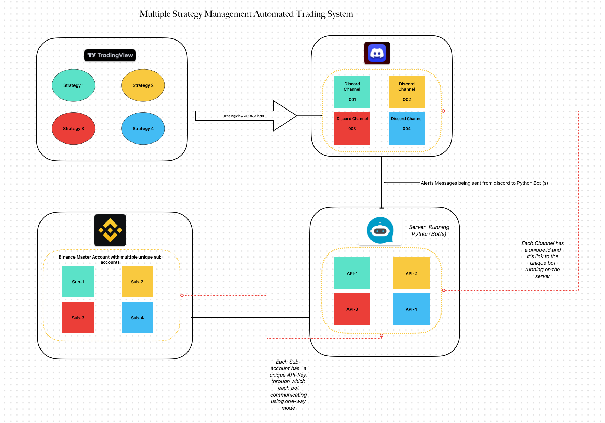

# 🚀 TradingView Strategy Automation with Discord Bot & Binance API

## Overview

This project automates a **TradingView strategy** by utilizing **Discord** and **Binance API**. It provides a seamless way to execute trades automatically on Binance based on alerts triggered in TradingView, which are sent to a designated Discord channel. The bot executes trades on Binance and sends real-time updates and order confirmations back to a second Discord channel.

### Key Features:
- 💬 **Discord Bot Integration**: Automatically receives TradingView alerts via Discord messages.
- ⚙️ **Binance API Automation**: Executes buy/sell orders based on TradingView signals.
- 📊 **Real-Time Market Data**: Fetches current price and account balance from Binance.
- 📡 **Order Status Updates**: Sends Binance order confirmations and notifications to a dedicated Discord channel.
- 🔒 **Secure**: Uses HMAC SHA-256 for signing API requests, ensuring safe transactions.

---
---
Here is the visual representation of the architecture


### Main Components:
1. **Discord Bot**: Listens for TradingView alerts and processes trading operations.
2. **Binance API**: Executes trades (buy/sell) on Binance Futures.
3. **Notification System**: Sends updates and trade confirmations to a separate Discord channel.

---

## Setup & Installation

### Prerequisites
- **Python 3.8+**
- **Discord Bot Token**: You can create a bot from the [Discord Developer Portal](https://discord.com/developers/applications).
- **Binance API Key**: Generate your API key from your [Binance account](https://www.binance.com/).

### Installation

1. **Clone the repository**:
    ```bash
    git clone https://github.com/nomannaq/tradingview-discord-binance-bot.git
    cd tradingview-discord-binance-bot
    ```

2. **Install required dependencies**:
    ```bash
    pip install -r requirements.txt
    ```

3. **Set up environment variables**:
   - Create a `.env` file in the root directory with your credentials:
    ```plaintext
    DISCORD_BOT_TOKEN=your-discord-bot-token
    BINANCE_API_KEY=your-binance-api-key
    BINANCE_SECRET_KEY=your-binance-secret-key
    YOUR_CHANNEL_ID=discord-channel-id-where-alerts-arrive
    ```

4. **Run the bot**:
    ```bash
    python main.py
    ```

---

## How It Works

1. **TradingView Alerts**: 
   - You configure your TradingView strategy to trigger alerts (e.g., "Crosses Above," "RSI Overbought").
   - The alerts are sent to a specific Discord channel that the bot monitors.

2. **Discord Message Parsing**:
   - The bot parses these messages (e.g., `LONG`, `SHORT`, `PRICE`, `QUANTITY`).
   - Based on the parsed message, the bot fetches the necessary market data from Binance and places a trade.

3. **Order Execution**:
   - For a `LONG` signal, the bot places a **limit buy** order slightly below the current price.
   - For a `SHORT` signal, it places a **limit sell** order slightly above the current price.

4. **Notifications**:
   - The bot posts updates (e.g., order status, available balance) in a second Discord channel to keep you informed.

---

## Example Workflow

1. **TradingView** triggers a `LONG` alert.
2. The bot reads the alert from the Discord channel.
3. The current price of `BTCUSDT` is fetched from Binance.
4. The bot calculates the max quantity you can trade based on your USDT balance.
5. A **limit buy order** is placed on Binance for BTCUSDT.
6. Order confirmation and the updated balance are sent to the notification channel.

---

## Commands

Here are some example commands that the bot will respond to:

- `LONG BTCUSDT`: Place a long (buy) order on BTCUSDT. (You can use any other symbol instead of BTCUSDT) 
- `SHORT BTCUSDT`: Place a short (sell) order on BTCUSDT.
- `PRICE`: Fetch the current price of BTC.
- `QUANTITY`: Check the maximum quantity available for trading.
- `CLOSE1`: Close a long position.
- `CLOSE2`: Close a short position.

---

## Customization

You can customize the bot based on your needs:
- **Symbol**: The default is `BTCUSDT`, but this can be modified for other trading pairs.
- **Order Types**: The bot uses limit orders by default, but it can be modified to use market orders.
- **Leverage**: Adjust leverage for futures trading.


## Contributing

Feel free to fork this repository and submit pull requests if you would like to contribute or improve the project. Any suggestions, bug fixes, or enhancements are always welcome.

---

## License

This project is licensed under the MIT License. See the [LICENSE](LICENSE) file for more details.

---

## Contact

For any queries or assistance, feel free to reach out:

- **GitHub**: [nomannaq](https://github.com/your-username)
- **Email**: nomannaq.aa@gmail.com

---


### Happy Trading! 📈🚀
